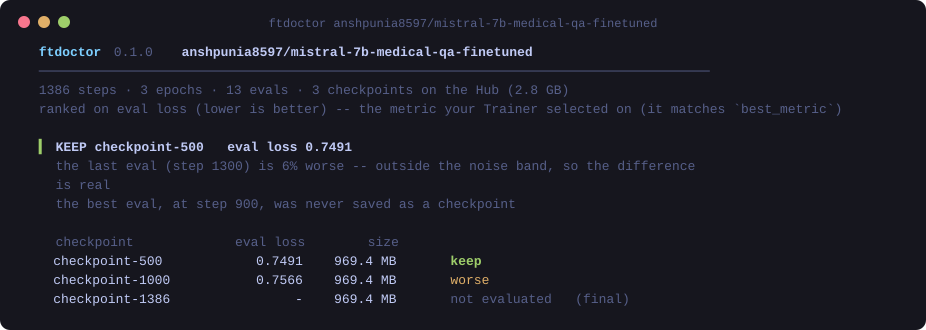

<div align="center">

# ftdoctor

**Did your fine-tune overfit? Which checkpoint should you keep? What can you delete?**

Point it at a training output folder — or at any model on the HuggingFace Hub — and get
the answer in a second.

[](https://github.com/junglezke/ftdoctor/actions/workflows/ci.yml)
[](https://pypi.org/project/ftdoctor/)
[](https://pypi.org/project/ftdoctor/)
[](LICENSE)



</div>

---

Works with anything built on the HuggingFace `Trainer` — **TRL's `SFTTrainer`, Unsloth,
LLaMA-Factory, Axolotl**, `Seq2SeqTrainer` for Whisper, plain `Trainer` for BERT. They all
leave the full training history in `trainer_state.json`, and almost nobody reads it.

## Try it on a public model — no install of anything else, no GPU

```bash
pip install ftdoctor
ftdoctor anshpunia8597/mistral-7b-medical-qa-finetuned
```

That is the banner above: a real Mistral-7B fine-tune on the Hub. ftdoctor reads its
`trainer_state.json` and the checkpoint folders the repo actually holds, and says:

- the best eval was at **step 900 — which was never saved**, so you cannot have it;
- of the checkpoints that exist, **`checkpoint-500`** is the best;
- the last eval is **6% worse**, and that is outside the eval's own noise, so it is real.

## On your own run

```bash
ftdoctor ./outputs                    # the folder with checkpoint-*/ in it
ftdoctor ./outputs/checkpoint-1200    # or any one checkpoint
ftdoctor trainer_state.json           # or just the file
```

```python
from ftdoctor import load, diagnose

result = diagnose(load("./outputs"))
print(result.headline)          # outputs: keep checkpoint-1000; overfitting.
print(result.pick.keep_step)    # 1000
```

## And get your disk back

A full fine-tune that saves every few hundred steps leaves dozens of multi-gigabyte
checkpoints behind. Most of each one is optimizer state you only need to *resume*
training.

```bash
ftdoctor prune ./outputs            # show the plan -- deletes nothing
ftdoctor prune ./outputs --apply    # do it
```

By default `prune` keeps the recommended checkpoint and the latest one untouched, and from
every other checkpoint removes only resume-only files — `optimizer.pt`, `scheduler.pt`,
RNG state, DeepSpeed shards. **Every model stays loadable.** `--mode full` deletes the other
checkpoints outright, and is refused when the run has no eval to base a recommendation on.

Before deleting anything, `--apply` re-checks each target is a `checkpoint-N` directory
directly inside your output folder, containing a `trainer_state.json`, and not one being
kept.

## What 89 public fine-tunes look like

To calibrate the checks, ftdoctor was run on **89 `trainer_state.json` files** published on
the Hub — LLM SFT and QLoRA runs, Whisper, BERT, audio classifiers. 88 were supervised
fine-tunes; one turned out to be an RL run (more on that below).

| | |
|---|---|
| **41 of 88 (47%)** | logged **no eval metric at all**. Nothing can tell whether they overfit — training loss only ever goes down. |
| **23** | had fewer than 5 evals: too few to tell a trend from noise. |
| **24** | had enough evals to judge. Of those: |
| &nbsp;&nbsp;10 | the final checkpoint was the best one. |
| &nbsp;&nbsp;**10** | the final checkpoint was *not* the minimum — **but the difference was within the eval's own noise**. A naive `argmin(eval_loss)` tells these people to go back to an earlier checkpoint for nothing. |
| &nbsp;&nbsp;4 | the final checkpoint was genuinely worse; 2 of them by more than 3%. |

And a few things only real logs turn up:

- **Loss that doubles at every epoch boundary.** A Qwen2.5-7B SFT whose loss jumped on the
  first step of each of its 10 epochs. Periodic, so not instability — the step straddling
  the epoch boundary computes its loss differently. The usual advice for loss spikes (lower
  the learning rate) would have been wrong.
- **Loss of exactly 0.0 from the first step — which was fine.** A Gemma-3-12B run whose
  name said SFT logged a loss of 0.0 from step one. An early version of ftdoctor called it
  "trained on nothing, labels masked". It was a GRPO run, where a loss near zero is normal.
  ftdoctor now recognises RL runs, skips the loss-based checks instead of misreading them,
  and hands them to [rldoctor](https://github.com/junglezke/rldoctor). (For a genuinely
  zero loss in SFT, the usual cause *is* every label masked to `-100` — and ftdoctor says so.)
- **Eval loss up 37%, accuracy still improving.** An audio classifier selected on accuracy.
  Judged on loss it overfit badly; judged on the metric its author actually chose, the last
  checkpoint was the best. ftdoctor recovers that choice from `best_metric` and says so.
- **`inf` gradients that do not matter.** A Mistral run logged `grad_norm = inf` at 10
  scattered steps out of 34,000. Under fp16 that is the loss scaler skipping an overflowing
  step — harmless, and telling someone to roll back over it would be wrong.

## What it checks

| | catches |
|---|---|
| **Which checkpoint** | best eval, the noise band around it, and the best checkpoint *that exists* |
| **Overfitting** | eval getting worse while training loss keeps falling; the train/eval gap; steps and hours spent after the best point |
| **Stopped improving** | the eval flatlined early: same result for a fraction of the compute |
| **Loss vs your metric** | eval loss rising while accuracy / WER / BLEU improves — not overfitting in the sense you care about |
| **No eval** | and the exact `TrainingArguments` to fix it |
| **Broken loss** | NaN loss; loss of exactly zero (masked labels) |
| **RL runs** | recognised and handed to rldoctor, not misread as a broken SFT |
| **Not learning** | loss flat or rising, with the learning rate that explains it |
| **Loss spikes** | real spikes, periodic ones, and ones that land on epoch boundaries — each with different advice |
| **Gradients** | exactly-zero gradients (nothing trainable), spikes that the loss felt, fp16 overflow that it didn't |
| **Learning-rate schedule** | a tail of steps trained at a learning rate of ~0 |
| **Eval below train** | eval loss consistently under training loss — check for train/eval overlap |
| **Unfinished runs** | the log ends before `max_steps` |

Every finding comes with the numbers it fired on and a concrete change to make.

## How it decides

**Noise-aware, not `argmin`.** Each eval metric has its own step-to-step noise, estimated
robustly from successive differences. Any checkpoint within 2× that noise (or 1%, whichever
is larger) of the best is reported as equivalent. "Your last checkpoint is 1.2% worse" is
only said when 1.2% is more than the eval's jitter.

**Your metric, not ours.** `trainer_state.json` records `best_metric` but not which metric
it was. ftdoctor finds the eval series that contains that exact value at `best_global_step`
and ranks on it — accuracy, WER, BLEU, whatever you selected on. Direction (higher or lower
is better) comes from the name, and is checked against which extreme the Trainer kept. Use
`--metric` to override.

**Only checkpoints that exist.** The best eval often lands on a step that was never saved,
or was deleted by `save_total_limit`. Checkpoints are taken from the folders really present
— on disk or on the Hub — never inferred from `save_steps`, which is meaningless under
`save_strategy="epoch"`. Given only a bare `trainer_state.json`, ftdoctor says it cannot
tell which checkpoints exist instead of guessing.

**Calibrated on real runs.** Every threshold was set against the 89 public runs above, and
several were changed because of them: a 1.5× loss-spike rule flagged ordinary small-batch
noise; a band-only overfitting rule called 1% drops "overfitting"; a global-median gradient
rule mistook the normal early-training decline for spikes. Ten of those runs are pinned in
[`validation/`](validation/runs.json) and re-checked in CI against their public sources.

## What it will not do

- **It only sees what was logged.** No eval metric, no overfitting verdict — it will tell
  you so rather than guess from training loss.
- **It does not run your model.** It reads the history. Whether the "best" checkpoint is good
  enough for your task is still a question for your own evaluation.
- **It cannot see sampling noise it was not shown.** The noise band comes from the eval's
  step-to-step variation. A tiny eval set can be noisy in ways a smooth curve hides; if yours
  has a few dozen examples, treat small differences with suspicion either way.
- **`prune` cannot be undone.** That is why it defaults to a dry run, defaults to keeping
  every model's weights, and checks every path before touching it.

## In CI

```bash
ftdoctor ./outputs --fail-on warning --format markdown -o "$GITHUB_STEP_SUMMARY"
```

Exits non-zero when a finding at that severity fires, and writes a Markdown report for the
job summary.

## Related

ftdoctor is for supervised fine-tuning. For **RL post-training** (GRPO, PPO, RLVR) — reward
hacking, entropy collapse, degenerate groups — see
[**rldoctor**](https://github.com/junglezke/rldoctor), and to test the reward function
itself, [**rewardlint**](https://github.com/junglezke/rewardlint).

## Development

```bash
git clone https://github.com/junglezke/ftdoctor && cd ftdoctor
pip install -e ".[dev]"
pytest                                                      # 59 tests
python validation/fetch.py && python validation/run.py --check   # the public runs
python tools/make_banner.py                                 # regenerate the README image
```

## Contributing

**The most useful thing you can send is a run where ftdoctor is wrong** — it called a fine
run broken, or missed something real. A link to a public model with a `trainer_state.json`
is enough. There is an issue template for it.

## License

Apache-2.0.
